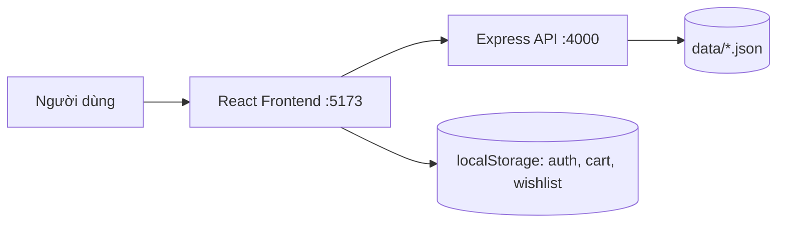
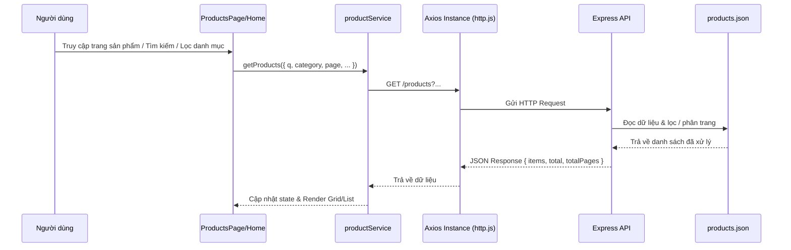
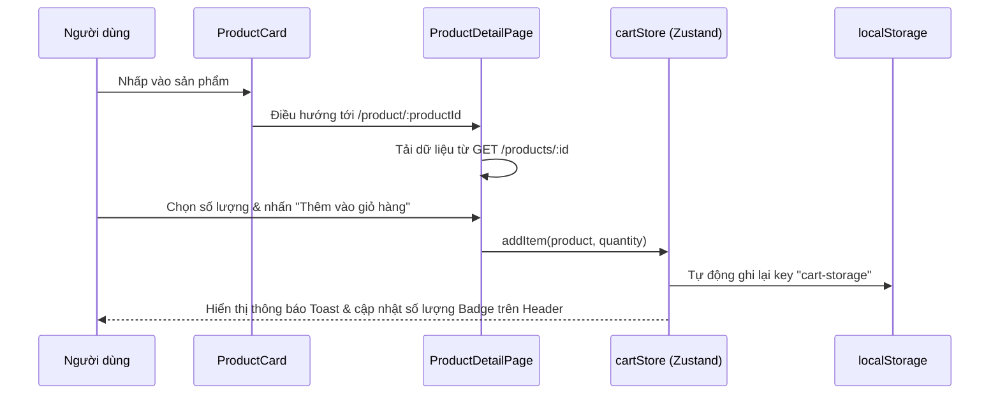
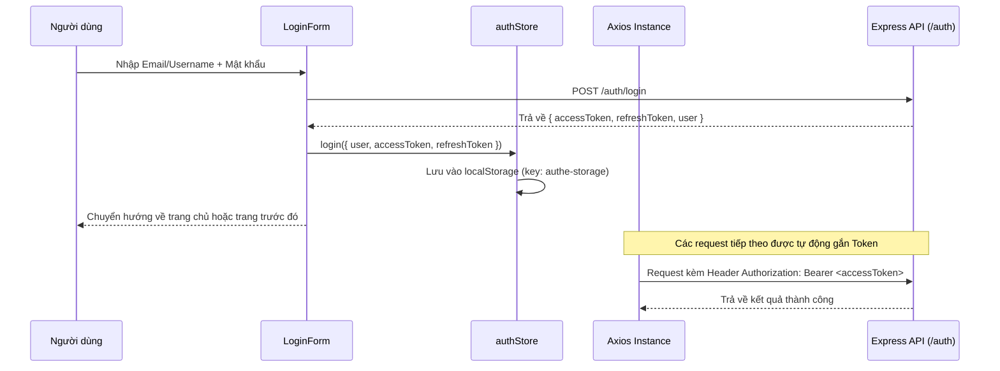
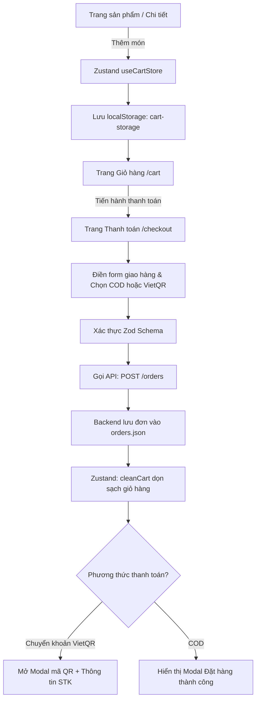

# E-commerce Project - Web Thương Mại Điện Tử Mini

Tài liệu này mô tả trạng thái hiện tại của toàn bộ workspace, các phần đã kết nối giữa frontend và backend, cách chạy dự án và các luồng nghiệp vụ đang có.

---

## 1. Tổng quan

Workspace gồm hai ứng dụng chính:

```text
Web_thuong_mai_dien_tu_mini/
├── Back-end/    # Node.js + Express mock REST API
├── Font-end/    # React 19 + Vite + Tailwind CSS v4 + Zustand
└── README.md
```

Backend hiện dùng các file JSON như một database học tập (`Back-end/data/*.json`). Frontend gọi backend qua HTTP (Axios Client) cho các tài nguyên: xác thực người dùng, sản phẩm, đơn hàng, quản trị và danh sách yêu thích.



---

## 2. Công nghệ

### Frontend

- **Core & Runtime**: React 19, JavaScript (ESM), Vite 8
- **Routing**: React Router DOM v7 (Hỗ trợ Nested Routes, Protected Routes, Lazy Loading)
- **State Management**: Zustand v5 (kết hợp middleware `persist` lưu `localStorage`)
- **Data Fetching & Cache**: TanStack Query v5 (React Query)
- **HTTP Client**: Axios (Cấu hình Interceptor tự động gắn Bearer Token)
- **Styling**: Tailwind CSS v4 (`@tailwindcss/vite`)
- **Form & Validation**: React Hook Form, Zod, `@hookform/resolvers`
- **UI Components & Icons**: Lucide React
- **Tiện ích khác**: SheetJS (`xlsx`) phục vụ Import/Export Excel trong Admin
- **Linter**: ESLint 10

### Backend

- **Runtime & Framework**: Node.js (>= 18), Express 5
- **Authentication**: JSON Web Token (`jsonwebtoken`)
- **Bảo mật & Middleware**: CORS, Custom Auth & Role Authorization Middleware, Global Error Handler
- **Môi trường**: Dotenv
- **Dev Tool**: Nodemon (Cấu hình tự bỏ qua thư mục `data/` khi ghi file)
- **Data Store**: Hệ thống file JSON lưu trữ cục bộ (`Back-end/data/*.json`) thông qua lớp truy xuất dữ liệu `JsonCollection` (bất đồng bộ `fs.promises`)

---

## 3. Cách chạy

Mở hai terminal riêng biệt cho Backend và Frontend:

### Backend

```powershell
cd Back-end
npm install
npm run dev     # Chạy với nodemon, tự động restart khi sửa code (bỏ qua data/)
# hoặc
npm start       # Chạy thường bằng node
```

Backend chạy tại:

```text
http://localhost:4000
```

### Frontend

```powershell
cd Font-end
npm install
npm run dev
```

Frontend mặc định chạy tại:

```text
http://localhost:5173
```

Frontend đọc biến môi trường từ file `Font-end/.env`:

```env
VITE_API_URL = http://localhost:4000/
```

Nếu thay đổi cổng backend, hãy cập nhật giá trị biến này tương ứng.

---

## 4. Cấu trúc chính

### Frontend (`Font-end/src/`)

```text
Font-end/src/
├── App.jsx                        # Root component
├── main.jsx                       # Entry point, bọc QueryClientProvider, BrowserRouter
├── Routes/                        # Hệ thống định tuyến
│   ├── AppRouter.jsx              # Định nghĩa toàn bộ route khách hàng & trang admin
│   ├── AuthRoute.jsx              # Guard route yêu cầu đăng nhập
│   └── AdminRoute.jsx             # Guard route yêu cầu role: "admin"
├── Services/                      # Tầng giao tiếp API (Axios)
│   ├── http.js                    # Axios instance, baseURL, Request/Response Interceptor
│   ├── productService.js          # API sản phẩm, danh mục, phân trang, lọc
│   ├── orderService.js            # API tạo đơn, xem đơn hàng khách hàng & admin
│   ├── userService.js             # API tài khoản, hồ sơ, đổi mật khẩu, quản lý user
│   └── favoriteService.js         # API danh sách yêu thích
├── Stores/                        # Quản lý state toàn cục (Zustand + Persist)
│   ├── authStore.js               # Lưu thông tin user, tokens (Key: authe-storage)
│   ├── cartStore.js               # Lưu giỏ hàng, số lượng sản phẩm (Key: cart-storage)
│   └── wishlistStore.js           # Lưu danh sách yêu thích (Key: wishlist-storage)
├── Layouts/                       # Bố cục giao diện
│   ├── Header.jsx                 # Top bar, logo, tìm kiếm, badge giỏ/yêu thích, user menu
│   ├── Footer.jsx                 # Chân trang thông tin & liên hệ
│   ├── TopBar.jsx                 # Thông báo đầu trang
│   └── AdminLayout.jsx            # Khung điều hướng & Sidebar trang quản trị
├── Pages/                         # Các màn hình chức năng
│   ├── home/                      # Trang chủ: Hero banner, danh mục, sản phẩm nổi bật
│   ├── products/                  # Danh sách sản phẩm (tìm kiếm, lọc giá, phân loại) & chi tiết
│   ├── auth/                      # Đăng nhập (LoginPage), Đăng ký (RegisterPage)
│   ├── cart/                      # Trang giỏ hàng, cập nhật số lượng, áp mã giảm giá
│   ├── checkout/                  # Trang thanh toán, form giao hàng, mã QR ngân hàng, đặt hàng
│   ├── wishlist/                  # Trang danh sách sản phẩm yêu thích
│   ├── account/                   # Trang cá nhân: Hồ sơ, Lịch sử đơn hàng, Sổ địa chỉ, Đổi mật khẩu
│   └── admin/                     # Quản trị viên: Dashboard, Quản lý sản phẩm, Đơn hàng, Người dùng
└── Components/                    # Các thành phần UI dùng chung (Button, Card, Modal, ...)
```

### Backend (`Back-end/`)

```text
Back-end/
├── server.js                      # Cấu hình Express app, CORS, error handler, nạp các routes
├── src/
│   ├── config.js                  # Cấu hình biến môi trường, JWT Secrets, thời hạn Token
│   ├── db.js                      # Class JsonCollection CRUD đọc/ghi JSON bất đồng bộ
│   ├── middleware/
│   │   └── auth.js                # Middleware xác thực accessToken & phân quyền role
│   └── routes/
│       ├── auth.routes.js         # Endpoint đăng nhập, cấp lại token, đăng xuất, lấy profile
│       ├── products.routes.js     # Endpoint sản phẩm, danh mục, CRUD admin, import/export
│       ├── orders.routes.js       # Endpoint đơn hàng, tạo đơn, cập nhật trạng thái
│       ├── users.routes.js        # Endpoint người dùng, phân quyền, đổi mật khẩu, khoá tài khoản
│       ├── favorites.routes.js    # Endpoint sản phẩm yêu thích
│       └── carts.routes.js        # Endpoint giỏ hàng backend (module dự phòng)
└── data/
    ├── products.json              # Dữ liệu sản phẩm và đánh giá
    ├── users.json                 # Dữ liệu tài khoản người dùng
    ├── orders.json                # Dữ liệu đơn đặt hàng
    ├── favorites.json             # Dữ liệu sản phẩm yêu thích theo tài khoản
    ├── vouchers.json              # Dữ liệu phiếu giảm giá
    └── carts.json                 # Dữ liệu giỏ hàng lưu trữ
```

---

## 5. Những phần đã làm

### 5.1. Kết nối dữ liệu sản phẩm (Products)

Frontend kết nối hoàn toàn với API sản phẩm từ Backend:

- Các file xử lý chính:
  - `Font-end/src/Services/productService.js`
  - `Font-end/src/Pages/products/ProductListPage.jsx`
  - `Font-end/src/Pages/products/ProductDetailPage.jsx`
- Các API được sử dụng:
  - `GET /products`: Hỗ trợ tìm kiếm theo từ khóa (`q`), lọc theo danh mục (`category`), lọc khoảng giá (`minPrice`, `maxPrice`), sắp xếp (`sort`), phân trang (`page`, `pageSize`).
  - `GET /products/categories`: Danh sách các danh mục hiện có.
  - `GET /products/:id`: Chi tiết 1 sản phẩm.
- Trang sản phẩm:
  - `/products`: Hiển thị danh sách dạng lưới/danh sách, bộ lọc nâng cao, thanh tìm kiếm.
  - `/product/:productId`: Xem chi tiết sản phẩm, hình ảnh, giá bán, mô tả, đánh giá sao, nút thêm vào giỏ hàng hoặc mua ngay.

### 5.2. Kết nối xác thực & tài khoản (Authentication)

- Các endpoint được kết nối qua `Font-end/src/Services/userService.js`:
  - Đăng nhập: `POST /auth/login` (Hỗ trợ linh hoạt bằng email, username hoặc fullName).
  - Đăng ký: `POST /users` (Tạo tài khoản mới với vai trò mặc định `customer`/`user`).
  - Đăng xuất: `POST /auth/logout` và xóa state trong `authStore`.
  - Cấp mới Access Token: `POST /auth/refresh-token`.
  - Lấy thông tin tài khoản hiện tại: `GET /auth/me`.
- Token và thông tin đăng nhập được lưu trữ tự động trong `localStorage` qua Zustand persist (`authe-storage`).
- Mỗi request qua Axios instance (`Services/http.js`) sẽ tự động gắn header:
  ```http
  Authorization: Bearer <accessToken>
  ```

**Tài khoản mẫu có sẵn trong hệ thống:**

| Định danh (Email / Username) | Mật khẩu | Vai trò (Role) | Họ và tên |
| :--- | :--- | :--- | :--- |
| `langochuyen@gmail.com` | `123456` | `admin` | Huyen (Quản trị viên) |
| `minhanh.tran98@gmail.com` | `123456` | `user` | Tran Thi Minh Anh |
| `tranhanhduc2000@gmail.com` | `123456` | `user` | Tran Anh Duc |

### 5.3. Quản lý Giỏ hàng (Cart) & Danh sách yêu thích (Wishlist)

- Giỏ hàng được quản lý toàn cục qua hook `useCartStore` (`Stores/cartStore.js`), tự động đồng bộ `localStorage` (`cart-storage`).
- Các tính năng giỏ hàng:
  - Thêm sản phẩm với số lượng tùy chọn.
  - Tăng / giảm số lượng, xóa từng món hoặc xóa toàn bộ giỏ hàng (`cleanCart`).
  - Tự động tính toán phụ phí, tạm tính, giảm giá và tổng thanh toán.
  - Badge số lượng và tổng tiền giỏ hàng hiển thị trực tiếp trên Header.
- Danh sách yêu thích qua hook `useWishlistStore` (`Stores/wishlistStore.js`), lưu trữ tại `localStorage` (`wishlist-storage`):
  - Nút tim (Yêu thích) bật/tắt nhanh trên từng sản phẩm.
  - Trang `/wishlist` quản lý sản phẩm yêu thích và chuyển nhanh vào giỏ hàng.

### 5.4. Đặt hàng & Thanh toán (Checkout & Orders)

- Route: `/checkout`
- Handled bởi hook `useCheckout`:
  - Form nhập thông tin nhận hàng (Họ tên, SĐT, Email, Địa chỉ chi tiết, Ghi chú giao hàng).
  - Tự động điền trước thông tin nếu khách hàng đã đăng nhập.
  - Chọn phương thức thanh toán: **COD (Thanh toán khi nhận hàng)** hoặc **Chuyển khoản ngân hàng (VietQR)**.
  - Xác thực form chặt chẽ với schema.
  - Áp dụng mã giảm giá (voucher).
  - **Kết nối API tạo đơn hàng thật**: Gọi `POST /orders` gửi dữ liệu lên Backend và ghi nhận vào file `orders.json`.
  - Tự động làm sạch giỏ hàng sau khi đặt đơn thành công.
  - Hiển thị Modal đặt hàng thành công hoặc Modal hiển thị mã QR kèm thông tin chuyển khoản (Số tài khoản, ngân hàng, số tiền, cú pháp).

### 5.5. Trang cá nhân & Quản trị hệ thống (Account & Admin)

- **Trang cá nhân (`/account`)** — Được bảo vệ bởi `AuthRoute`:
  - Xem & cập nhật thông tin cá nhân.
  - Xem lịch sử đơn hàng đã đặt lấy trực tiếp từ `GET /orders/user/:userId`.
  - Quản lý sổ địa chỉ giao hàng.
  - Đổi mật khẩu tài khoản trực tiếp qua `POST /users/:id/change-password`.
- **Trang quản trị (`/admin/*`)** — Được bảo vệ bởi `AdminRoute`:
  - `/admin/dashboard`: Báo cáo tổng quan, doanh thu, đơn hàng, biểu đồ tăng trưởng.
  - `/admin/products`: Danh sách sản phẩm, thêm/sửa/xóa sản phẩm, nhập dữ liệu hàng loạt và xuất Excel (`.xlsx`).
  - `/admin/orders`: Xem danh sách đơn hàng toàn sàn, cập nhật trạng thái đơn (Chờ xử lý, Đang giao, Hoàn thành, Đã hủy).
  - `/admin/users`: Quản lý danh sách thành viên, khóa / mở khóa tài khoản, phân quyền quản trị.

### 5.6. Bảng danh sách Route Frontend hiện tại

| Route | Component | Quyền hạn | Trạng thái |
| :--- | :--- | :--- | :--- |
| `/` | `HomePage` | Public | Hoạt động đầy đủ (Banner, Danh mục, Sản phẩm) |
| `/products` | `ProductListPage` | Public | Đã kết nối API (Lọc, tìm kiếm, sắp xếp, phân trang) |
| `/product/:productId` | `ProductDetailPage` | Public | Đã kết nối API (Chi tiết, hình ảnh, mua ngay, thêm giỏ) |
| `/login` | `LoginPage` | Public | Đã kết nối API Auth (Xác thực, cấp token, lưu store) |
| `/register` | `RegisterPage` | Public | Đã kết nối API Users (Tạo tài khoản mới) |
| `/cart` | `CartPage` | Public | Đã kết nối Zustand `useCartStore` + Persist |
| `/checkout` | `CheckoutPage` | Public / User | Đã kết nối API Orders (Tạo đơn thật, sinh mã QR ngân hàng) |
| `/wishlist` | `WishlistPage` | Public | Đã kết nối Zustand `useWishlistStore` + Persist |
| `/account` | `AccountPage` | Cần Đăng nhập (`AuthRoute`) | Đã kết nối API Profile, Đơn hàng cá nhân, Đổi mật khẩu |
| `/admin/dashboard` | `DashboardPage` | Quản trị (`AdminRoute`) | Thống kê số liệu doanh thu và biểu đồ trực quan |
| `/admin/products` | `ProductManagementPage` | Quản trị (`AdminRoute`) | CRUD sản phẩm, phân trang, Import/Export Excel |
| `/admin/orders` | `OrderManagementPage` | Quản trị (`AdminRoute`) | Quản lý và đổi trạng thái toàn bộ đơn hàng |
| `/admin/users` | `UserManagementPage` | Quản trị (`AdminRoute`) | Danh sách thành viên, khóa tài khoản, chỉnh sửa |

---

## 6. Backend API

### Authentication (`/auth`)

| Method | Endpoint | Mô tả | Quyền hạn |
| :--- | :--- | :--- | :--- |
| `POST` | `/auth/login` | Đăng nhập (email/username/fullName + password), trả về access & refresh token | Public |
| `POST` | `/auth/refresh-token` | Cấp access token mới từ refresh token hợp lệ | Public |
| `POST` | `/auth/logout` | Thu hồi refresh token khỏi bộ nhớ server | Public |
| `GET` | `/auth/me` | Lấy thông tin tài khoản người dùng hiện tại từ token | Cần `accessToken` |

> *Ghi chú:* Access token hết hạn sau 60 giây (hoặc cấu hình) để thuận tiện kiểm tra refresh flow. Refresh token có hiệu lực trong 7 ngày.

### Products (`/products`)

| Method | Endpoint | Mô tả | Quyền hạn |
| :--- | :--- | :--- | :--- |
| `GET` | `/products` | Lấy danh sách sản phẩm (có query `q`, `category`, `minPrice`, `maxPrice`, `sort`, `page`, `pageSize`) | Public |
| `GET` | `/products/categories` | Lấy danh sách tất cả các danh mục | Public |
| `GET` | `/products/category/:categoryName` | Lọc sản phẩm theo tên danh mục | Public |
| `GET` | `/products/:id` | Lấy chi tiết một sản phẩm theo ID | Public |
| `POST` | `/products` | Thêm sản phẩm mới | Admin |
| `PUT` | `/products/:id` | Cập nhật toàn bộ thông tin sản phẩm | Admin |
| `PATCH` | `/products/:id` | Cập nhật một phần thông tin sản phẩm | Admin |
| `DELETE` | `/products/:id` | Xóa sản phẩm | Admin |
| `POST` | `/products/bulk` | Thêm hàng loạt sản phẩm (hỗ trợ nhập từ Excel) | Admin |

### Orders (`/orders`)

| Method | Endpoint | Mô tả | Quyền hạn |
| :--- | :--- | :--- | :--- |
| `GET` | `/orders` | Lấy danh sách đơn hàng (hỗ trợ lọc theo trạng thái, từ khóa, phân trang) | Admin |
| `GET` | `/orders/user/:userId` | Lấy lịch sử đơn hàng của một người dùng | Chính chủ hoặc Admin |
| `GET` | `/orders/:id` | Lấy thông tin chi tiết một đơn hàng | Chính chủ hoặc Admin |
| `POST` | `/orders` | Tạo đơn hàng mới từ giỏ hàng hoặc thông tin thanh toán | Khách hoặc Thành viên |
| `PATCH` | `/orders/:id/status` | Cập nhật trạng thái đơn hàng (`pending`, `processing`, `delivered`, `cancelled`) | Admin |
| `DELETE` | `/orders/:id` | Xóa đơn hàng | Admin |

### Users (`/users`)

| Method | Endpoint | Mô tả | Quyền hạn |
| :--- | :--- | :--- | :--- |
| `GET` | `/users` | Lấy danh sách toàn bộ người dùng (đã ẩn trường password) | Admin |
| `GET` | `/users/:id` | Lấy thông tin chi tiết của một người dùng | Chính chủ hoặc Admin |
| `POST` | `/users` | Đăng ký tài khoản người dùng mới (role mặc định `user`/`customer`) | Public |
| `PUT` | `/users/:id` | Cập nhật toàn bộ hồ sơ người dùng | Chính chủ hoặc Admin |
| `PATCH` | `/users/:id` | Cập nhật một phần hồ sơ người dùng | Chính chủ hoặc Admin |
| `DELETE` | `/users/:id` | Xóa tài khoản người dùng | Admin |
| `POST` | `/users/:id/change-password` | Đổi mật khẩu tài khoản | Chính chủ |
| `POST` | `/users/:id/toggle-lock` | Khóa hoặc mở khóa quyền truy cập của tài khoản | Admin |

### Favorites (`/favorites`)

| Method | Endpoint | Mô tả | Quyền hạn |
| :--- | :--- | :--- | :--- |
| `GET` | `/favorites` | Lấy danh sách sản phẩm yêu thích kèm thông tin chi tiết sản phẩm | Cần `accessToken` |
| `POST` | `/favorites` | Thêm sản phẩm vào danh sách yêu thích | Cần `accessToken` |
| `DELETE` | `/favorites/:userId/:productId` | Xóa sản phẩm khỏi danh sách yêu thích | Cần `accessToken` |

---

## 7. Các luồng chính

### 7.1. Luồng tải danh sách sản phẩm & tìm kiếm, lọc



### 7.2. Luồng xem chi tiết sản phẩm & thêm vào giỏ hàng



### 7.3. Luồng đăng nhập & xác thực (JWT Auth & Interceptors)



### 7.4. Luồng giỏ hàng, đặt hàng & thanh toán



---

## 8. Kiểm tra dự án

Dự án đã được cấu hình và chạy kiểm tra định kỳ:

### Kiểm tra Frontend

```powershell
cd Font-end
npm run lint      # Kiểm tra quy chuẩn mã nguồn với ESLint
npm run build     # Biên dịch gói sản phẩm cho production với Vite
```

Kết quả:
- **Build**: Vite biên dịch production thành công (`dist/index.html`, `dist/assets/*`).
- **ESLint**: Hoàn thành không có lỗi ngăn chặn (0 errors).

### Kiểm tra Backend

- Server khởi chạy mượt mà tại cổng `4000`.
- Các endpoint `/auth`, `/products`, `/orders`, `/users`, `/favorites` phản hồi đúng chuẩn dữ liệu REST API.

---

## 9. Những phần chưa hoàn thiện & Hạn chế cần lưu ý

1. **Bộ nhớ Refresh Token**:
   - `validRefreshTokens` ở backend hiện lưu trong biến RAM của tiến trình Node.js. Khi restart server, danh sách refresh token sẽ bị xóa, người dùng cần đăng nhập lại khi token hết hạn.
2. **Đồng bộ Giỏ hàng (Cart Sync)**:
   - Giỏ hàng hiện tại hoạt động ở phía Client với `localStorage`. Module `carts.routes.js` ở backend đã có sẵn nhưng chưa được mount và đồng bộ liên tục qua API theo thời gian thực (hiện tại ưu tiên tối ưu tốc độ client).
3. **Cơ chế ghi dữ liệu JSON**:
   - `JsonCollection` trong `db.js` đọc/ghi file trực tiếp bằng `fs.promises`. Chưa có cơ chế khóa file (file lock) đối với các trường hợp truy cập ghi đồng thời với tần suất lớn.
4. **Bảo mật mật khẩu**:
   - Mật khẩu mẫu đang lưu ở dạng chuỗi gốc để phục vụ môi trường học tập và kiểm thử.

---

## 10. Ghi chú backend

Backend được thiết kế chuyên biệt phục vụ học tập và đồ án thực tập:

- Dữ liệu có tính bền vững (**persist**) giữa các lần request vì được ghi trực tiếp vào các file JSON trong thư mục `Back-end/data/`.
- Nodemon được cấu hình lệnh `--ignore data/ server.js` để tránh tình trạng server tự khởi động lại mỗi khi có request ghi dữ liệu vào file JSON.
- Đã trang bị middleware xử lý lỗi tập trung (**Global Error Handler**) ở cuối `server.js` nhằm ngăn chặn tình trạng sập server khi client gửi dữ liệu sai cấu trúc JSON.

---

## 11. Hướng phát triển đề xuất

1. **Chuyển đổi Database**: Thay thế các file JSON bằng hệ quản trị cơ sở dữ liệu quan hệ (PostgreSQL / MySQL) hoặc NoSQL (MongoDB) kết hợp Prisma / Mongoose.
2. **Mã hóa mật khẩu**: Bổ sung thư viện `bcrypt` để băm mật khẩu trước khi lưu trữ.
3. **Nâng cấp Refresh Token**: Lưu trữ refresh token trong Redis hoặc cơ sở dữ liệu kèm cơ chế Token Rotation.
4. **Cổng thanh toán thực tế**: Tích hợp các cổng thanh toán trực tuyến như VNPay, MoMo, ZaloPay hoặc Stripe.
5. **Thông báo qua Email**: Gửi email xác nhận đơn hàng tự động cho khách hàng sau khi tạo đơn thành công qua Nodemailer.
6. **Viết Unit/Integration Tests**: Bổ sung bộ kiểm thử tự động với Vitest / Jest cho các hook Zustand và các route Express.
